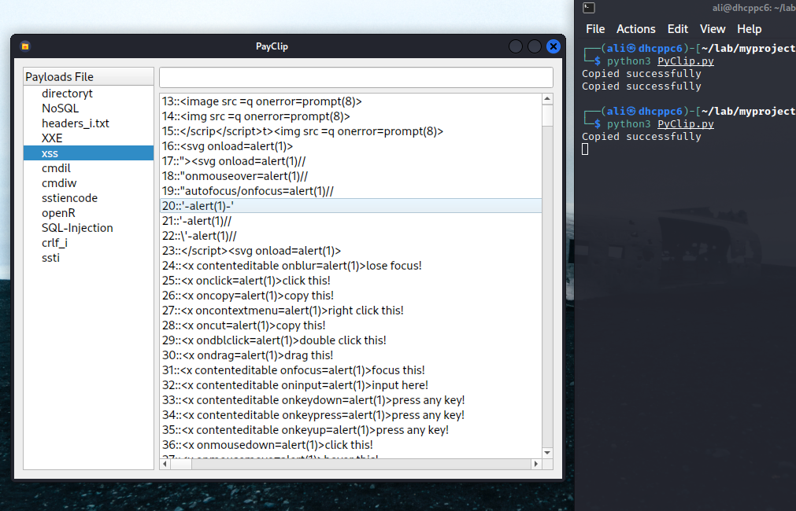

# PayClip
 PayClip is a simple yet powerful tool for penetration testers and bug bounty hunters. It lets you organize payloads into categories (e.g., XSS, SQLi, XXE, etc.) and quickly copy them with a single click. No more digging through text files—everything you need is neatly organized and ready to use from one interface.

 
 

## Usage : 

- to use this tool you just need to creat `tools` folder on `/opt` then copy `PayClip` folder there or run `git clone https://github.com/bwiko/PayClip` then creat symbolic link to  `PyClip.py`
- to use `BpyClip.py` you need to make costum shortcut with the command : `/opt/tools/BpyClip.py` and select the text then press the shortcut and it will be replaced with the payload, **Text format must be -> templatename:numberofpaylod** example `xss:10`

[demo vedio](https://youtu.be/PuwthzSHvv0)

## Features : 
- [X] one click - payload copy
- [X] you can use `BpyCilp.py` to quickly genereat payload from text format but it need some configration 
- [X] cmd description if you just hover over the `payload|cmd` to do this you just need to add `<-> description text ` on the end of cmd or payload
- [X] you can use it with [vselector](https://github.com/bwiko/THunarCA/tree/main/scripts) to make dynamic commands
- [X] you can add your own template on -> `./PayClip/templates`

## Planned Features : 

- [ ] search function based on tags
- [ ] using database instead of files template
