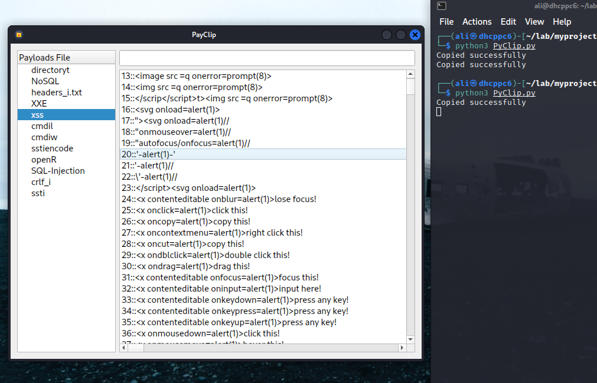
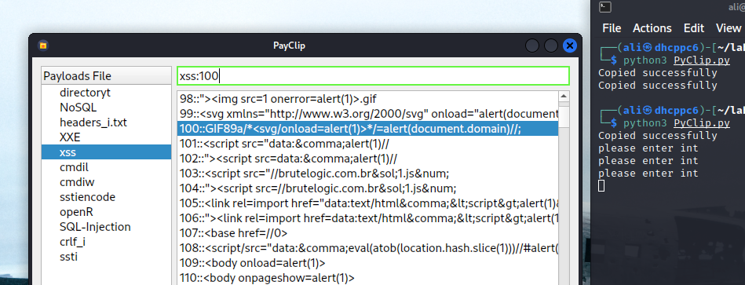
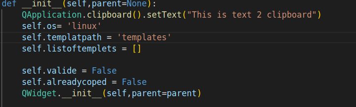
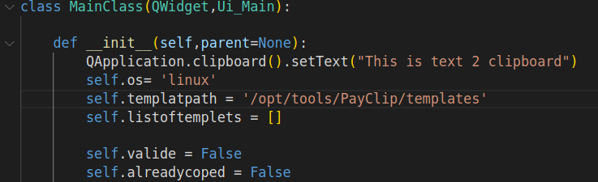

# PayClip
You can use this tool to  transfer payloads to the clipboard so you can use them more quickly.


# Install
```
$ git clone https://github.com/bwiko/PayClip
$ cd PayClip`
$ pip3 install -r requirements.txt
```

# Usage 
```
$ python3 python3 PyClip.py
```

# Guide 

## Simple usage 

To copy the payload to the clipboard, simply click the payload file, then the payload.



## Using command 

To obtain a payload by command, simply type the following syntax then press enter , and the payload will be copied for you.

```
payloadfile:number_of_payload 
```



## 

## Add more Payloads 

Just create or copy payloads file on `template` folder  

# NOTE 

`REMAMBER THAT U CAN USE THIS TOOL AS SYSTEM SHORTCUT IF U DO THAT DONT FORGET TO CHANGE THE PATH OF template FOLDER TO ABSOLUTE PATH `

 
